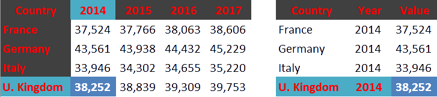

layout: true
<div class="wer-header">  </div>
<div class="wer-footer"> <span> &copy;2019 WeR meetup <br> https://github.com/WeR-stats/ </span> </div>

```{r setup, echo=FALSE, results='hide', message=FALSE, warning=FALSE}
pkgs <- c('dplyr', 'knitr', 'nycflights13', 'readr', 'readxl', 'tidyr')
invisible(lapply(pkgs, require, char = TRUE))
geo_path <- 'https://datamaps.uk/geography/'
data_path <- 'https://datamaps.uk/datasets/'
bnd_path <- 'https://datamaps.uk/boundaries/uk/rds/'
```

---
# Why *tidyr*

Provides functionalities to *reshape* the layout of data sets

--

 - Make observations from variables using `gather`

--

 - Make variables from observations with `spread`
 
--

 - Split columns using `separate`
 
--

 - Merge columns with `unite`


---
# *tidyr* verbs

`gather`

Used to reshape a dataset from *wide* to *long* format

Collapses multiple columns into two columns:
 - a *key* column that contains the former column names
 - a *value* column that contains the former column cells


---
# *tidyr* verbs

<br>
```{r echo=FALSE, out.width="120%", out.height="120%"}
knitr::include_graphics("tidy0.png")
```

---
# *tidyr* verbs

<br>
```{r echo=FALSE, out.width="120%", out.height="120%"}

```

---
# *tidyr* verbs

<br>
```{r echo=FALSE, out.width="120%", out.height="120%"}

```

---
# *tidyr* verbs

<br>
```{r echo=FALSE, out.width="120%", out.height="120%"}

```

---
# *tidyr* verbs

<br>
```{r echo=FALSE, out.width="120%", out.height="120%"}
knitr::include_graphics("tidy4.png")
```

---
# *tidyr* verbs

<br>
```{r echo=FALSE, out.width="120%", out.height="120%"}

```

---
# *tidyr* verbs

<br>
```{r echo=FALSE, out.width="120%", out.height="120%"}

```

---
# *tidyr* verbs

`gather(data, key, value, cols)`

 - `data` dataframe to reshape in long form
 - `key` name of the new *key* (string) column
 - `value` name of the new *value* (string) column
 - `cols` name(s) or position(s) of the columns to collapse

--

Additional arguments:
 - `na.rm` insert `TRUE` to remove all rows from output where the *value* column is `NA`
 - `factor_key` insert `TRUE` to store the *key* values as factor (preserves the original ordering)

---
# *tidyr* verbs: *gather*

.font70[
  ```{r }
  dts <- data.frame(
      'Country' = c('France', 'Germany', 'Italy', 'U. Kingdom'),
      'Y2014' = c(37524, 43561, 33946, 38252),
      'Y2015' = c(37766, 43938, 44432, 45229),
      'Y2016' = c(38063, 34302, 34655, 35220),
      'Y2017' = c(38606, 38839, 39309, 39753)
  )
  ```
]

.font90[
  ```{r , echo=FALSE}
  dts %>% mutate_if(is.numeric, format, big.mark = ',') %>% kable('html')
  ```
]

---
# *tidyr* verbs

`gather(dts, 'year', 'value', 2:ncol(dts))`

.font40[
```{r echo=FALSE}
dts %>% 
  gather('year', 'value', 2:ncol(dts)) %>%
  mutate(value = format(value, big.mark = ',')) %>% 
  kable('html')
```
]]

---
# *tidyr* verbs

## Your Turn

Try to apply the above operation on the file 
`cqc_hsca_active_locations.xlsx` 
using only the columns concerning the *Regulated Activity*

Imagine how the tidy dataset would look like with the three variables:
 - *location_id*
 - *activity*
 - *value*
 
---
# *tidyr* verbs

## Possible solution

.font70[
```{r eval = FALSE}
data_path <- '~/workshop/data/datasets/'
file.path(data_path, 'original', 'cqc_hsca_active_locations.xlsx') %>% 
  read_xlsx(2) %>% 
  select(location_id = `Location ID`, starts_with('Regulated')) %>% 
  gather('activity', 'value', starts_with('Regulated'), factor_key = TRUE) %>% 
  replace_na(list(value = 'N')) %>% 
  head()
```
]


---
# *tidyr* verbs

`spread`

Used to reshape a dataset from *long* to *wide* format

Expand one column into multiple columns, filling the resulting cells with values from another column
 - a *key* column that contains the new column names, each unique value in the *key* column becomes a new column name
 - a *value* column that contains the new column cells


---
# *tidyr* verbs

`spread(data, key, value)`

 - `data` dataframe to reshape in wide form
 - `key` name(s) or position(s) of the column(s) that provide the column names
 - `value` name(s) or position(s) of the column(s) that provide the values for the cells

--

Additional arguments:
 - `fill` the value to insert when a value is missing (default is `NA`)
 - `drop` insert `FALSE` to keep the *key* values as factor
 - `sep` insert a separator to build new column names 


---
# *tidyr* verbs

`separate(data, col, into, sep, remove = TRUE)`

 - `data` dataframe to reshape
 - `col` the column name or position to split
 - `into` the name of the new variables
 - `sep` the symbol to use to separate the old variable for naming the new columns
 - `remove` insert `FALSE` to keep the old column

---
# *tidyr* verbs

`unite(data, col, [vars], sep, remove = TRUE)`

 - `data` dataframe to reshape
 - `col` Name of the new column
 - `vars` a selection of named columns to concatenate, empty for *all* columns
 - `sep` the symbol to use as separator between the old values to create the new value
 - `remove` insert `FALSE` to keep the old column

---
# Resources

--

 - [Cheat Sheet]()
 
--

 - [Reference]()
 
--

 - [RStudio Tutorials]()

--

 - [Datacamp Skill Track]()


---
# Thank You!

 - [`r icon::fa("twitter")` @datamaps](https://twitter.com/datamaps)

 - [`r icon::fa("github")` lvalnegri](https://github.com/lvalnegri)
 
 - [`r icon::fa("linkedin")` Luca Valnegri](https://www.linkedin.com/in/lucavalnegri)
